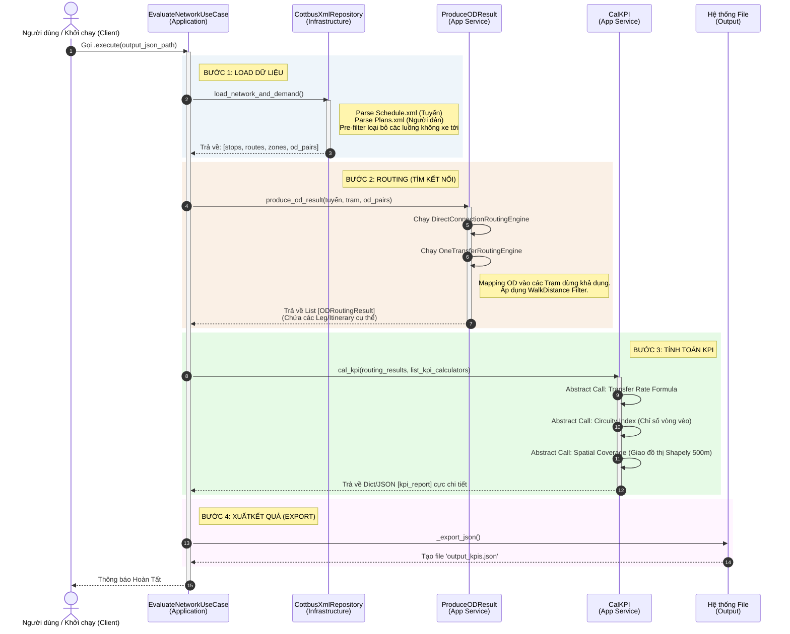

# Báo Cáo Phân Tích Chuyên Sâu Cấu Trúc Và Luồng Xử Lý Hệ Thống Đánh Giá KPI Mạng Lưới Xe Buýt

Tài liệu này cung cấp một cái nhìn toàn diện, trực quan và chuyên sâu về kiến trúc phần mềm, cấu trúc dữ liệu, và luồng vận hành của hệ thống đánh giá mạng lưới xe buýt. Nội dung được thiết kế dưới dạng tài liệu chi tiết (Technical Document), phù hợp để trích xuất trực tiếp làm tư liệu báo cáo, viết khóa luận hoặc thuyết trình dự án cho các bên liên quan (Stakeholders / Reviewers).

---

## 1. Biểu Đồ Và Phân Tích Kiến Trúc Tổng Thể (Cấu Trúc Clean Architecture & DDD)

Dự án được triển khai trên nền tảng tư duy **Clean Architecture** (Kiến trúc Sạch) kết hợp **Domain-Driven Design (DDD)**. Triết lý thiết kế này bảo vệ "trái tim" của hệ thống (Domain - Nghiệp vụ lõi) khỏi những thay đổi liên tục của các yếu tố ngoại vi (như công nghệ cơ sở dữ liệu, framework UI, hay cách lấy dữ liệu). 

### 1.1. Biểu đồ Cấu trúc Hệ thống (Structural Schema)

```mermaid
graph TD
    classDef infra fill:#f9d0c4,stroke:#333,stroke-width:2px;
    classDef app fill:#fef0d9,stroke:#333,stroke-width:2px;
    classDef domain fill:#d4edda,stroke:#333,stroke-width:2px;

    subgraph INFRA[1. Infrastructure Layer - Tầng Hạ Tầng]
        XML[(Dữ liệu XML: <br> schedule.xml, plans.xml)]
        Repo[CottbusXmlRepository <br> (Implements Repository Port)]
    end

    subgraph APP[2. Application Layer - Tầng Ứng Dụng]
        UseCase[EvaluateNetworkUseCase <br> (Orchestrator)]
        ODProd[ProduceODResult <br> (Routing Coordinator)]
        Cal[CalKPI <br> (KPI Coordinator)]
        Ports[Interfaces / Ports]
    end

    subgraph DOMAIN[3. Domain Layer - Tầng Nghiệp Vụ Lõi]
        subgraph Entities [Thực thể & Cấu trúc Dữ liệu]
            E_Route[Route, Stop, Zone, Point]
            E_Itin[Leg, Itinerary, ODPair, ODRoutingResult]
        end
        subgraph Services [Domain Services]
            S_Route[Routing Engines: <br> Direct, OneTransfer]
            S_KPI[KPI Calculators: <br> Transfer, Circuity, Spatial]
        end
    end

    %% Mối liên hệ
    XML -->|Đọc file/Parse| Repo
    Repo -.->|Phụ thuộc ngược| Ports
    UseCase -->|Dependency Injection| Ports
    UseCase -->|Sử dụng| ODProd
    UseCase -->|Sử dụng| Cal
    ODProd -->|Gọi hàm nghiệp vụ| S_Route
    Cal -->|Gọi hàm nghiệp vụ| S_KPI
    S_Route -->|Thao tác dữ liệu| Entities
    S_KPI -->|Thao tác dữ liệu| Entities

    class XML,Repo infra;
    class UseCase,ODProd,Cal,Ports app;
    class E_Route,E_Itin,S_Route,S_KPI domain;
```

### 1.2. Phân Tích Cấu Trúc Lớp (Tư liệu báo cáo)
**Mô hình trên phân lập hệ thống thành 3 vành đai bảo vệ:**

- **Vành đai Domain (Xanh lá - Trong cùng):** Chứa các quy tắc kinh doanh nguyên thủy nhất. Ví dụ, việc quy định "Làm sao để đo khoảng cách giữa 2 điểm trên 1 tuyến xe buýt" nằm ở đây thông qua các đối tượng `Route` và `Point`. Các module thuật toán tính cực kỳ phức tạp như `RoutingEngine` (Tìm đường) hay `KpiService` (công thức trạm dừng bao phủ) nằm ở đây để tái sử dụng mà không cần quan tâm là code đang chạy trên Web hay Terminal.
- **Vành đai Application (Vàng - Ở giữa):** Đây là hệ thần kinh trung ương của quy trình. `EvaluateNetworkUseCase` không tự mình tính toán bất cứ thứ gì (không có phép toán +, -, *, /), nó chỉ đảm nhiệm vai trò **Đốc công (Orchestrator)**. Nó "nhờ" Repository lấy dữ liệu, "nhờ" `ProduceODResult` tìm đường, và "nhờ" `CalKPI` để chấm điểm. Điều này đảm bảo tính Single Responsibility Principle (SRP).
- **Vành đai Infrastructure (Đỏ - Ngoài cùng):** Chứa các chi tiết triển khai cụ thể (Implementation details). Hiện tại, để giả lập POC (Proof of Concept), dự án dùng `CottbusXmlRepository` trích xuất thông tin từ file `.xml`. Trong tương lai, chỉ việc tạo 1 class `PostgresSqlRepository` thay thế vào là toàn bộ hệ thống vẫn chạy như cũ mà không cần sửa 1 dòng code ở Domain hay Application.

---

## 2. Các Trường Thông Tin - Thiết Kế Aggregate & Entity

Nhờ triển khai DDD, các đối tượng mang ý nghĩa nghiệp vụ (Business Meaning) cực cao. Thay vì viết những chuỗi hay mảng vô nghĩa, hệ thống định nghĩa các trường dữ liệu:

- **Point / Toạ độ:** 
  - Đóng gói (Lat, Lon) và ngay lập tức cung cấp property tiện ích `distance_to()` nhờ tích hợp library `geopy` và hệ `shapely`. Mọi tính toán hình học Metric (mét) hay Hệ tọa độ EPSG ẩn giấu tại đây.
- **Route & Stop (Tuyến & Điểm đỗ):**
  - **`Route`** bao gồm `id`, hướng tuyến `Direction`, shape tuyến (chuỗi Point tạo thành LineString) và chuỗi tuần tự danh sách `Stop`. Đặc biệt, `Route` ở hệ thống này mang trong mình **Rich Behavior** (Hành vi phong phú) thay vì chỉ là biến trơn (Anemic Domain), như việc chứa hàm `get_cricuity_index_between_2_stops()`.
- **Zone & ODPair (Khu vực & Nhu cầu):**
  - **`Zone`**: Một đại lượng không gian 2D, có ranh giới (`boundary` - mảng Point) và tâm khu vực (`centroid`). Sở hữu chức năng `is_point_in_zone()` dựa vào giao điểm Ray-Casting của đa giác.
  - **`ODPair`**: Chứa khu vực Start, khu vực Destination và sản lượng hành khách (`travel_demand`).
- **Leg & Itinerary (Chặng đi & Hành trình):**
  - Một `Itinerary` (Lịch trình hoàn chỉnh) được ghép từ n `Leg` (Các chặng đi lẻ ngắn). Đối tượng này phơi bày các thuộc tính thống kê ngay lúc gọi (`total_transfers`, `get_list_stops_id`). `AggregatedItinerary` được sinh ra để nén nhiều sự lựa chọn tương đồng thành một "Siêu hành trình" (Hyperpath).

---

## 3. Bản Đồ Luồng Dữ Liệu Và Tương Tác Use Case

Để người mới (kể cả FE truyền API, hay Data Scientist phân tích) hiểu cách hệ thống chạy, ta xem xét Use Case chính thông qua sơ đồ luồng dữ liệu (Sequence Data Flow).

### 3.1. Biểu đồ Tuần tự Use Case (Main Execution Flow)



### 3.2. Cấu trúc Giao thức / API Đầu vào - Đầu ra (Tư liệu tương tác)

**1. Giao thức Đầu vào (Input Source):** 
Ở giai đoạn hiện tại (thông qua `CottbusXmlRepository`), dữ liệu cấp vào có định dạng mô phỏng giao thông MATSim (Khu vực Châu Âu: Cottbus):
- `schedule.xml`: Định nghĩa Network tọa độ hình học (Hàng ngàn Transit Stops dọc tuyến, tọa độ X/Y được parser scale thành Long/Lat).
- `plans.xml`: Ma trận dữ liệu người dân (`<person>`). Mọi Activity (như Home, Work) chứa Tọa độ (X, Y) được bóc tách chuyển hoá thành O (Origin) và D (Destination), bọc thành khu vực bằng tham số `zone_half_size_deg`.

**2. Giao diện Đầu ra (Output Target):**
Hệ thống kết xuất một tệp JSON, trở thành API Data Schema chuẩn cho các hệ thống BI Dashboard, Web Maps frontend (như Leaflet, Mapbox) vẽ biểu đồ. Cấu trúc điển hình:
```json
{
    "summary": {
        "total_od_pairs_evaluated": 200,
        "total_stops": 348,
        "total_routes": 45,
        "phase": "POC Phase 1"
    },
    "kpi_report": {
        "od_kpi_results": [
            {
                "od_id": "OD_1234",
                "kpi_results": {
                    "Tranfer_rate_caculate": [ {"agg_itinerary_0": {"score": "0"}} ],
                    "Cricuity_index_caculate": [ {"itinerary_0": {"score": 1.25, "route_sequence": ["L2"], "stop_sequence": ["S10", "S40"]}} ],
                    "KPIASpatialCoverageService": [
                        { "od_id_OD_1234": { "score_percent": 85.5, ... } }
                    ]
                }
            }
        ]
    }
}
```

Với sơ đồ này, bất cứ kỹ sư phần mềm nào khi tham gia cũng nhận thấy rõ **ranh giới trách nhiệm**. Nếu muốn cập nhật bộ lọc khoảng cách đi bộ, họ sẽ chui vào `domain_service/routing_service`. Nếu đổi database, họ code file mới ở thư mục `infrastructure/repositories/`. Cấu trúc module tạo ra sự cô lập lỗi tuyệt vời và luồng dữ liệu một chiều hoàn hảo.
